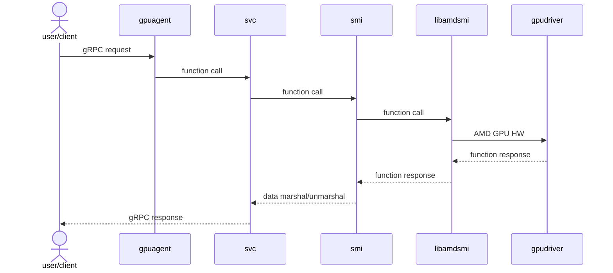

# Developer Guide

This document provides build instructions and guidance for developers working on the AMD GPU-Agent repository.

## Environment Setup

The project Makefile provides a easy way to create a docker build container that packages the build utilities needed to build this repository. The following environment variables can be set, either directly or via a `dev.env` file:

- `DOCKER_REGISTRY`: Docker registry (default: `docker.io/rocm`).
- `BUILD_BASE_IMAGE`: Base image for Docker build container (default: `ubuntu:22.04`).

## Build Prerequisites

Before starting, ensure you have Docker installed and running with the user permissions set appropriately.

## Quick Start

To quickly build everything using Docker:
```bash
make docker-build docker-compile
```

## Building Components

### Build and Launch Docker Build Container Shell

Run the following command to start a Docker-based build container shell:

```bash
make docker-shell
```

This gives you an interactive Docker environment with necessary tools pre-installed. It is recommended to run all other Makefile targets in this build environment.

### To attach to the Build Container Shell
```bash
docker exec -it gpuagentbuild bash
```

### Compiling the AMD Device Metrics Exporter

To compile from within the build environment, run:

```bash
make -C sw/nic/gpuagent
```

This command builds:
- sw/nic/build/x86_64/sim/bin/gpuagent


# Architecture

## API layer
North Bound [API definitions](sw/nic/gpuagent/protos)
Internal gpuagent [Model Definitions](sw/nic/gpuagent/api)

## Service layer
gRPC services are being handled through service layer [svc](sw/nic/gpuagent/svc)

## Data Abstraction layer
[smi](sw/nic/gpuagent/api/smi) layer is responsible for 
populating/retrieving data from the clients through libraries. 
This takes care of translating internal data
[models](sw/nic/gpuagent/api/include) to respective protobuf payloads for the
northbound definitions.

### Data clients
- amdsmi : data obtained through [libamdsmi](sw/nic/gpuagent/api/smi/amdsmi/smi_api.cc)



